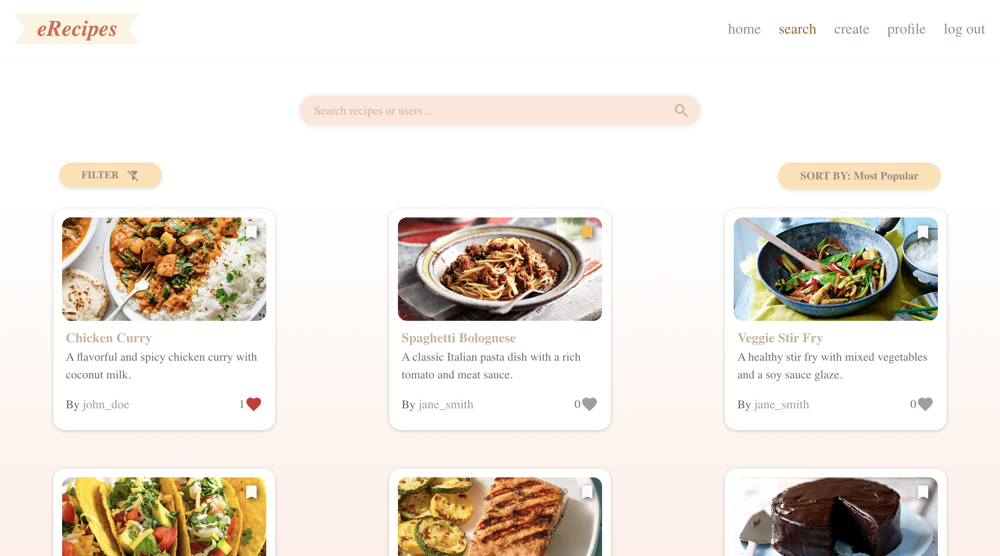
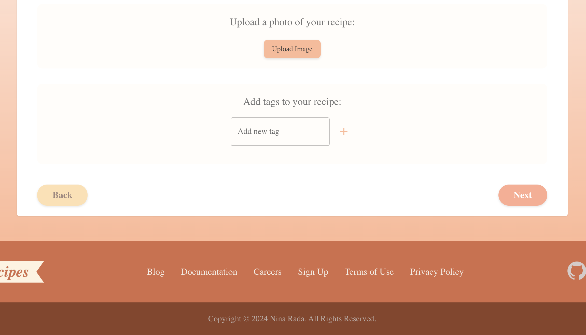
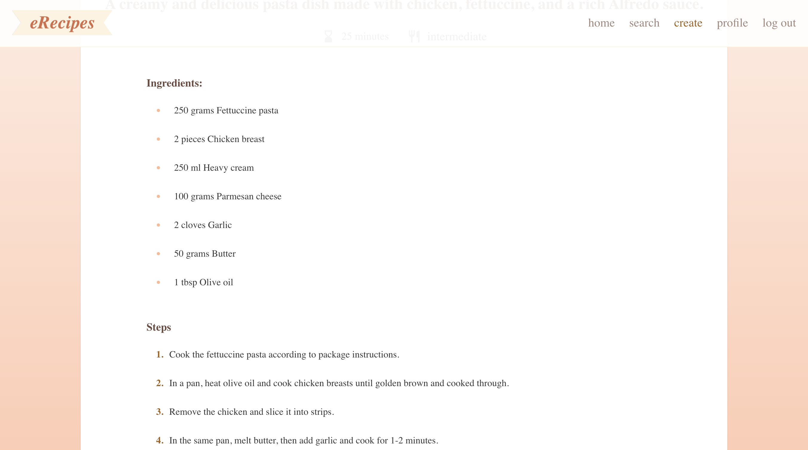

# Recipe App 🍽️

A full-stack MERN (MongoDB, Express, React, Node.js) application where users can browse, create, and interact with recipes. The app allows users to manage their profiles, rate, favorite, bookmark recipes, and search for their favorite dishes.

## 📑 Table of Contents

- [Features](#features)
- [App Preview](#app-preview)
- [Tech Stack](#tech-stack)
- [How to Run Locally](#how-to-run-locally)

## Features

- **User Authentication**: Register, login, and manage user accounts securely.
- **Browse Recipes**: Search and explore a variety of recipes.
- **Create Recipes**: Users can create and share their own recipes with others.
- **Profile Management**: View and edit user profile information.
- **Favorites & Bookmarks**: Favorite recipes and bookmark them for later access.
- **Recipe Rating**: Rate recipes based on user preferences.
- **Search**: Search for recipes by name or author.
- **Responsive UI**: A clean and mobile-friendly interface for seamless user experience.

## App Preview

### **Login Page**
The login page allows users to access their accounts using their credentials. It’s designed with a clean and minimalistic layout for a smooth login experience.

  

### **Sign Up Page**
Users can create new accounts using the sign-up page. The sign-up form collects basic information such as username, email, and password to register new users.

  

### **Homepage**
The homepage introduces users to the Recipe App with a clean and modern design. It features a collection of featured recipes, quick navigation to search and browse all recipes, and user-friendly links to other sections such as adding a recipe or viewing saved recipes. The homepage provides a welcoming environment for users to dive right into the world of cooking.

  
  
  
  
  

### **Search Page**
The Search Page allows users to find recipes quickly and efficiently. Users can search for recipes by typing keywords into the search bar, filter results by tags, and sort the results based on various criteria. The page includes the following features:

1. **Search Bar**: Users can type keywords (e.g., recipe name, author) into the search bar to find relevant recipes.
2. **Tag Filters**: The user can filter the search results by selecting tags such as "Vegetarian," "Dessert," "Quick Meals," etc., to narrow down the recipe options.
3. **Sorting Options**: Users can sort the search results by different criteria such as: Most Popular, Newest, Highest Rated...
4. **Recipe Results**: Displays the list of recipes that match the search criteria, with options to view, like, or bookmark them.

  

  
  

### **Create New Recipe**
The "Create New Recipe" page allows users to submit their own recipes in a step-by-step process, ensuring they provide all the necessary information for their dish. The form is displayed in a card with slides, guiding users through each section. The steps include:

1. **Start Cooking**: An introduction section where users can begin the recipe creation process.
2. **Title and Description**: Input fields for the recipe title and a brief description of the dish.
3. **Ingredients**: A section for users to list all the ingredients needed for the recipe.
4. **Instructions**: A detailed area for users to enter the cooking instructions step by step.
5. **Additional Info**: Option to include any extra details like cooking time, difficulty level, or tags.
6. **Review**: A final step where users can review their recipe before submission.

  
  
  
  
  
  
  
  

### **User Profile**
The user profile page allows users to view and manage their personal information, including the recipes they've created, liked, bookmarked, and rated. It also provides options to edit their profile details and change their password. The page is divided into the following sections:

1. **My Recipes**: Displays all the recipes that the user has created. Users can view, edit, or delete their own recipes.
2. **Liked Recipes**: Shows a list of recipes that the user has liked, allowing them to revisit their favorite dishes.
3. **Bookmarked Recipes**: A collection of recipes that the user has bookmarked for later. These recipes are saved for easy access.
4. **Rated Recipes**: A section where users can see all the recipes they've rated, with the corresponding ratings they gave.
5. **Profile Details**: Displays the user's basic information, such as their username, email, and profile picture. Users can update their personal details here.
6. **Change Password**: Users can update their password for enhanced security.

  
  
  
  

## Tech Stack

- **Frontend**: React, Redux, Material-UI, Axios, React Router
- **Backend**: Node.js, Express.js
- **Database**: MongoDB
- **Authentication**: JWT (JSON Web Token) for secure user authentication
- **Styling**: Material-UI (MUI) for UI components, custom styling with CSS/SCSS
- **Other Tools**: Bcrypt for password hashing, Multer for file uploads (if applicable)

## How to Run Locally

To run the Recipe App locally on your machine, follow these steps:

1. **Clone the repository**:
   git clone https://github.com/<your-username>/recipe-app.git
   cd recipe-app

2. **Set up the Backend**:
    - Open a terminal and navigate to the backend directory: cd backend
    - Install the backend dependencies: npm install
    - Start the backend server: npm run start

3. **Set up the Frontend**:
    - Open a second terminal window and navigate to the frontend directory: cd frontend
    - Install the frontend dependencies: npm install
    - Start the frontend application: npm run start

4. **Access the App:**:
    Open your browser and go to http://localhost:3000 to view the app running locally.
